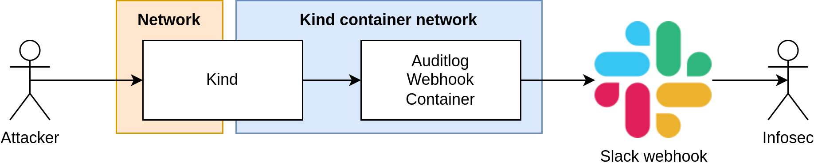

# Kubernetes honeytokens
This is PoC project to create a Kubernetes users without any privilges these tokens can be places across the infrastracture and monitored as these should not used.
The project is made of multiple bash scripts mainly the `setup_kind.sh` which creates a basic kind cluster with the webhook which monitors the audit logs and sends them to slack.
Additionally there is the `create_token.sh` which creates the token.

## Cluster creation
```bash
export KUBERNETES_ADDR=10.43.17.42
export SLACK_WEBHOOK_URL=https://hooks.slack.com/services/XXXXXXX/YYYYYYYY/ZZZZZZZZZZZZz 
./setup_kind.sh
```
The `setup_kind.sh` creates a local Kubernetes cluster and exposes it to the `KUBERNETES_ADDR` and sets up the kind network with the webhook server so the cluster could send the audit logs to it.

The kind is not recommended to run in the public ntwork as it lacks some security features https://kind.sigs.k8s.io/docs/user/configuration/#networking. These clusters should be exposed from the machine to internal network where you can monitor attackers activity. There should be no production deployments on this cluster and should server only for these tokens. If you want to setup the Kubernetes honeytokens on your existing Kubernetes server you need to add to it the webhook configuration and restart it.


## User creation
```bash
./create_token.sh username
```
After creating the cluster you can create a token.


## Design



